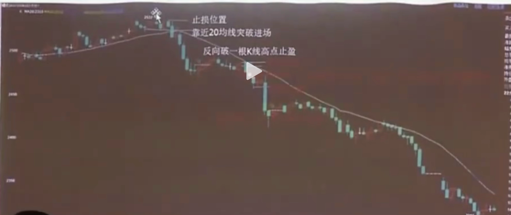
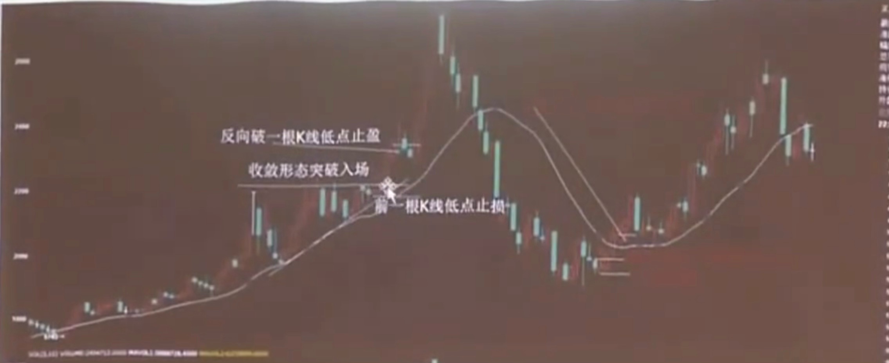

# jingang_strategy
一个用于期货交易的策略

## 策略介绍
- 只做4种形态：
  1. 平台突破或突破后的回调，平台越长区间越窄越好
  2. 上升趋势种的W底，第二个底高于第一个底
  3. 下降趋势中的M顶，第二个顶高于第一个顶
  4. 收敛形态，收敛的越窄越好
- 顺日线趋势：找到符合以上4种日线形态的品种，靠近20日均线最好，都没有标准形态的话，就做
日线趋势最明显的那个，趋势明显的只做单向单子

## 开仓与止盈
### 开仓进场

- 靠近20日均线突破进场，在20日均线上方做多，20日均线下方做空
- 止盈离场
  1. 当日线没有明显趋势的话，连续阴线，突然出现一个阳线突破前一根阳线的高点止盈离场
  2. 当日线有明显趋势的话，连续下跌之后一般会进入平台整理，当突破平台时候进行止盈。
  3. 当平台整理期间会出现M顶下跌趋势时候，此时M顶应该也都在均线以下，当顶点跌破前一根k线的低点进场，
  最好在M顶靠近均线的时候，且这个时候顶点是一根阴线，即高开靠近均线然后下跌破前一根k线，前一根k线最好是小阳线，
  形成顶部，止损设置在前一根k线的高点
### 以下是日线没有明显趋势的时候

- 收敛形态的突破：20均线上方振幅逐渐减小，当突破平台高点时候进场，止损设置在前一根k线的低点，止盈设置在当一根阴线跌破前一个阳线的低点进行止盈。
- W底突破，当第二个阴线底高于第一个阴线，形成w底，第二个底之后出现一根阳线，突破前一根阴线的高点，且最好突破是在靠近均线的地方，止盈也是当出现一根阴线跌破前一根阳线的低点

